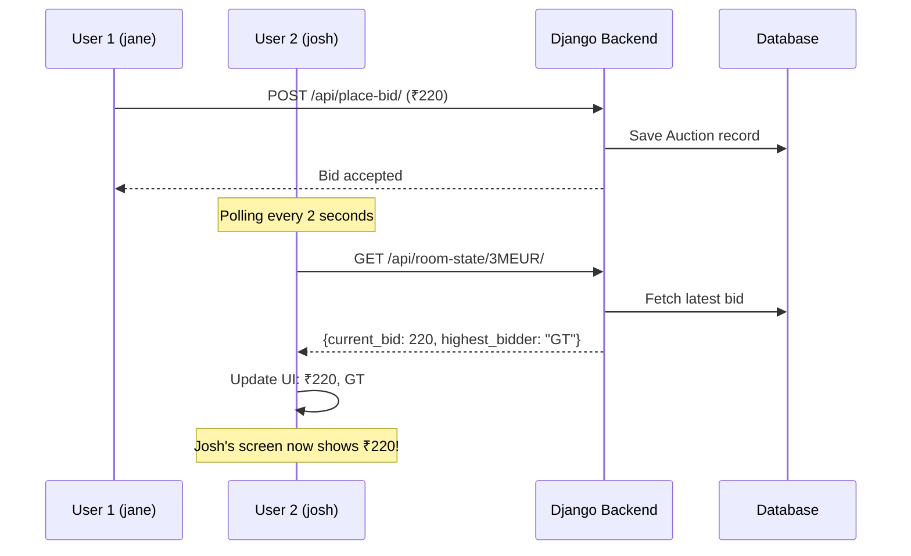

# Real-Time Auction Updates - Implementation Summary

## Problem
When one user (jane) placed a bid, other users (josh) in the same auction room couldn't see the updates in real-time. The status remained "WAITING" and the bid amount didn't sync.

## Solution Implemented

### 1. **Backend Changes**

#### Added New API Endpoint: `get_room_state`
**File**: `c:\Users\Lenovo\auction_web\auction\views.py`

- Created endpoint to fetch current auction state: `/api/room-state/<code>/`
- Returns: `room_code`, `is_live`, `current_bid`, `highest_bidder`

#### Updated `place_bid` Function
**File**: `c:\Users\Lenovo\auction_web\auction\views.py`

- Now saves each bid to the `Auction` table immediately
- Creates a Team object if it doesn't exist
- Links bid to current player and room

#### Updated `start_auction` Function
**File**: `c:\Users\Lenovo\auction_web\auction\views.py`

- Sets `room.is_live = True` when host starts auction
- Enables status synchronization across all users

#### Updated URL Configuration
**File**: `c:\Users\Lenovo\auction_web\auction_web\urls.py`

- Added route: `path("api/room-state/<str:code>/", get_room_state)`

---

### 2. **Frontend Changes**

#### Added Polling Mechanism
**File**: `c:\Users\Lenovo\auction-frontend\src\components\AuctionRoom.js`

**Implementation**:
```javascript
useEffect(() => {
    const pollInterval = setInterval(() => {
        axios.get(`http://127.0.0.1:8000/api/room-state/${roomCode}/`)
            .then(res => {
                const data = res.data;
                
                // Update current bid and highest bidder
                if (data.current_bid > 0) {
                    setCurrentBid("₹" + data.current_bid);
                    setBidAmount(data.current_bid);
                    setHighestBidder(data.highest_bidder);
                }
                
                // Update status
                if (data.is_live) {
                    setStatus("BIDDING LIVE");
                }
            })
            .catch(err => console.error("Polling error:", err));
    }, 2000); // Poll every 2 seconds

    return () => clearInterval(pollInterval);
}, [roomCode]);
```

#### Updated `startAuction` Function
- Now calls backend API to set room status
- Syncs "BIDDING LIVE" status to all users

---

## How It Works



---

## Testing

1. **Open two browser windows**
2. **Window 1**: Create room as "jane" with team "GT"
3. **Window 2**: Join same room as "josh" with team "PBKS"
4. **Window 1**: Click "START AUCTION" → Both see "BIDDING LIVE"
5. **Window 1**: Click "PLACE BID" → Bid increases to ₹220
6. **Window 2**: Within 2 seconds, automatically updates to show ₹220

---

## Key Features

✅ **Polling every 2 seconds** - Automatically syncs state  
✅ **Live bid updates** - All users see latest bid  
✅ **Highest bidder tracking** - Shows which team is winning  
✅ **Status synchronization** - "WAITING" → "BIDDING LIVE" syncs  
✅ **Automatic cleanup** - Clears interval on component unmount  

---

## Future Enhancements

For better performance, consider upgrading to:
- **WebSocket** (Django Channels) for instant updates
- **Server-Sent Events (SSE)** for one-way real-time streaming

Current polling solution works well for small-scale auctions with <20 users.
